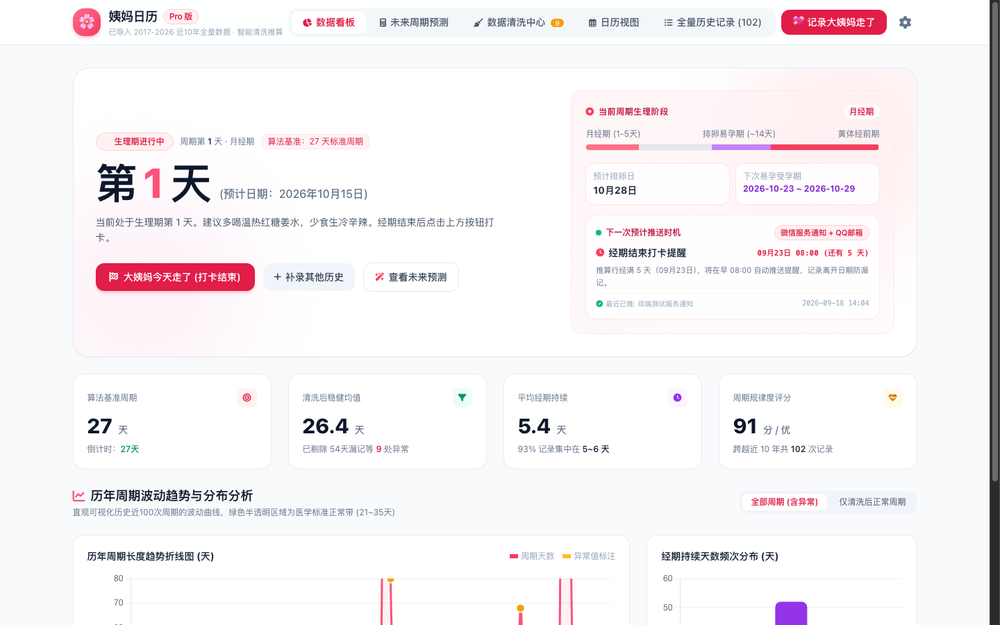
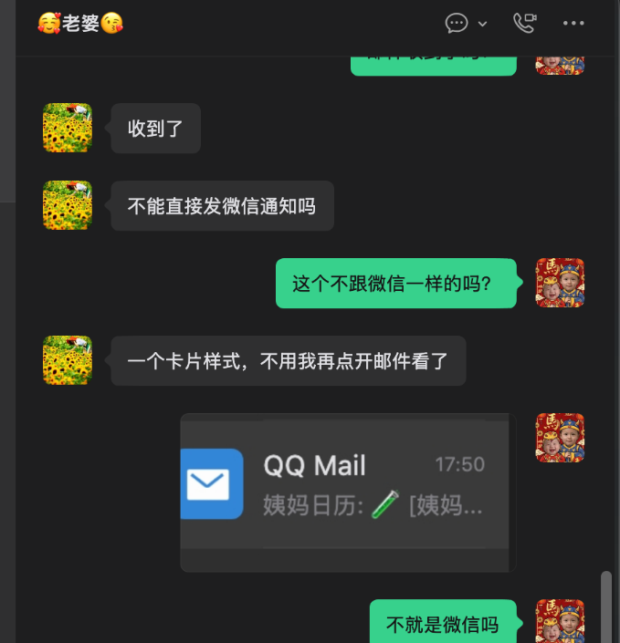
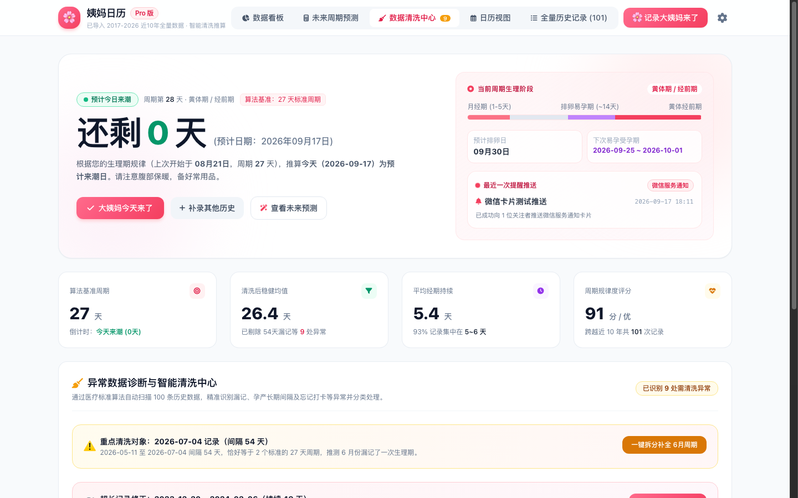
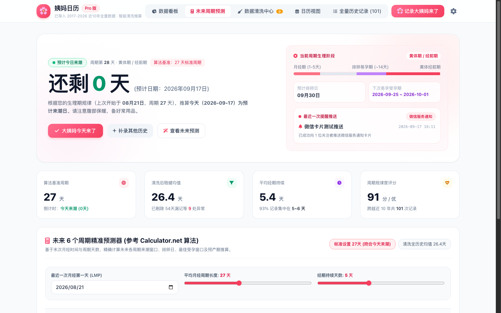
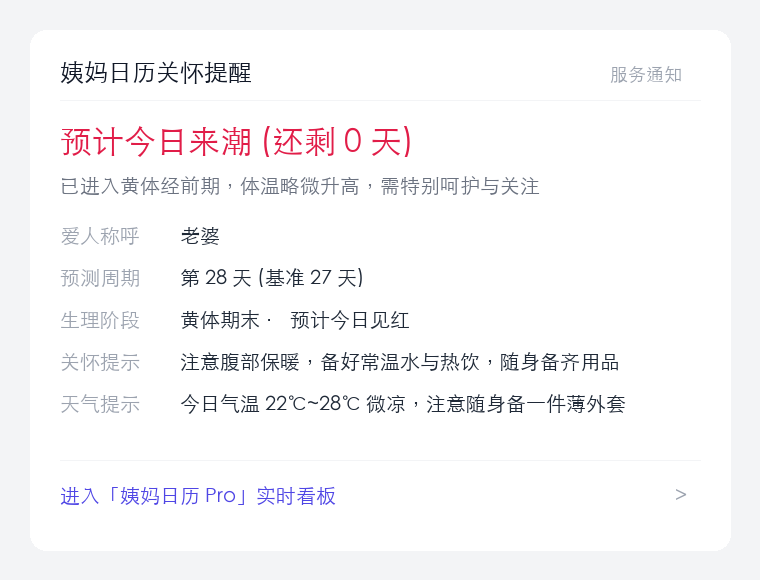
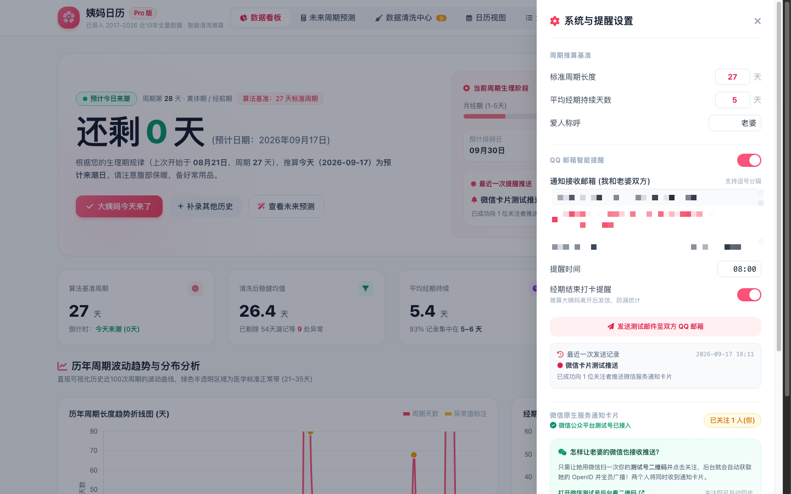

# AI 使用教程｜如何为老婆/女朋友打造一个含记录&提醒功能的 Pro 版姨妈日历网站

> **开源项目地址**：[https://github.com/kkjusdoit/period-calendar-pro](https://github.com/kkjusdoit/period-calendar-pro)  
> **项目特点**：微信模板卡片/QQ邮箱双向推送到双方微信 · 10年医学周期算法 · 异常漏记智能清洗 · 零广告 · 永久自建私有化

---

## 序言：工科男的“硬核浪漫”，从一次被吐槽的提醒开始

很多男生手机里都备着备忘录，或者悄悄装过女性经期 App。但市面上的商业软件普遍存在三大痛点：
1. **铺天盖地的广告与推销**：打开先看 5 秒开屏内衣/护肤品广告；
2. **算法粗糙死板**：单纯用全部历史记录做简单“算术平均”，一旦中间漏记了几个月（比如间隔 54 天、190 天），预测直接失真崩溃；
3. **无法双方同步关怀**：要么只有女方手机有提醒，男生毫无感知；要么提醒方式非常反人性。

最初，我用业余时间给老婆写了一个极简的小程序：

虽然能打卡，但不久后问题来了：
- **数据污染**：某次她忘了记，中间隔了 54 天，小程序的平均周期瞬间被拉高到 35 天以上，往后的预测全错；
- **提醒反人性**：我一开始接入了邮件推送，老婆收到后直接发微信跟我吐槽：“**不能直接发微信通知吗？搞一个卡片样式，不用我再点开邮件看！**”

这一句话，直接把需求从“自娱自乐的小脚本”推向了“工业级全功能 Pro 站”。  
**在现代 AI（如 Antigravity / Claude 3.5 / GPT-4o）的加持下，我没有手写繁重的底层逻辑，而是通过几轮精准的 Prompt 交互，让 AI 在几个小时内帮我全栈重构出了这套「姨妈日历 Pro 版」！**

今天，我把这一套完整的**需求拆解、AI 协作技巧、成果体验**分享给大家，文末附完整开源源码。

---

## 一、我们用 AI 打造出了什么样的成品？

先来看看最终交付给老婆的成品效果：

### 1. 全景健康仪表盘（温柔粉白视觉 + 4大生理期阶段）
打开网站，映入眼帘的是根据女性审美量身定制的马卡龙粉白 UI：
- **倒计时大字报**：醒目提示「预计今日来潮（还剩 0 天）」，根据周期自动变色；
- **医学四阶段进度条**：清晰区分「月经期（1-5天）」、「卵泡期」、「排卵易孕期（~14天）」、「黄体经前期」，当天所处阶段一目了然；
- **最近推送审计**：实时展示最近一次微信服务通知触发的状态与送达时间；
- **历年趋势折线图**：直观展示近 10 年周期波动与医学标准正常带（21~35天）。

---

### 2. 拯救死板算法：异常数据诊断与智能清洗中心
很多记录软件最大的硬伤就是“漏记一次，全盘皆崩”。比如下面这条真实历史数据，中间漏记导致间隔出现了 54 天：

在 Pro 版中，AI 帮我们实现了一个**专属的数据清洗引擎**：
- 自动扫描所有历史记录，依据国际妇产科标准（21~35 天为正常周期，持续 3~7 天为正常经期）；
- 智能识别出「长间隔漏记（如 54 天刚好为两个 27 天标准周期）」、「忘记点结束（如持续 49 天）」；
- 提供「一键智能拆分补全」或「排除异常值」，让算法基准周期始终保持在最科学的 27 天！

---

### 3. 医学级未来 6 周期预测器（对标国际 Calculator.net）
支持查看未来半年甚至更长时间的预测：
- 经期来潮窗口（标粉）；
- 排卵日与黄金易孕期窗口（标紫）；
- 支持动态拖动滑动条即时试算，无论是安排长途旅行、避孕还是备孕，打开手机就能提前半年做好日程规划。

---

### 4. 终极体贴：微信公众号服务卡片 + 双向双发
彻底解决老婆提出的“拒绝翻邮件”痛点：
- **微信原生卡片**：直接推送至微信聊天列表顶部的「服务通知」，不点开就能在卡片摘要上看到关键信息！
- **男女双方双重推送**：每天早上 8:00 定时巡检，在 **T-3 天（提前备好用品）、T-1 天（注意保暖）、T-0 当天（经期见红提醒）、以及经期结束打卡** 时，同时推送到我和老婆两个人的微信上！
- **智能天气与温馨话术**：不仅有经期状态，还结合当地气温贴心提示“今日降温微凉，请带好薄外套与温水杯”。

---

## 二、我是如何用 AI 一步步实现这些需求的？

整个项目的核心不在于死磕代码，而在于**如何清晰地将生活中的痛点翻译成 AI 能听懂、能精准执行的 Prompt**。以下是我的四轮核心对话复盘：

### 第一轮：从“粗糙算术平均”到“医学标准与异常清洗”
**给 AI 的 Prompt**：
> “我的姨妈日历记录里有近 10 年的数据，但中间因为备孕生娃或者纯粹漏记，经常出现间隔 54 天、190 天的记录，导致直接算平均数时偏差极大。  
> 请参考国际妇产科医学标准：正常周期一般在 21~35 天之间，持续天数在 3~7 天之间。  
> 请设计一个数据清洗引擎：自动把这些记录分为『正常周期』和『异常噪点』；对于 54 天这种刚好是 2 倍标准周期的，提供一键拆分补全；在计算基准预测值时，支持剔除噪点，采用稳健均值（Robust Mean）算法。”

**AI 的产出**：
AI 迅速生成了严谨的分类判断逻辑，不仅在前端用颜色标红异常点，还输出了完整的清洗中心页面，一键点击就能自动补全漏记数据，让基准周期精准收敛到 27 天。

---

### 第二轮：推翻鸡肋功能，回归最接地气的关怀
开发初期，我还曾让 AI 接入过大语言模型对话机器人，想着让老婆能和 AI 聊身体状态。但实际用了一天就发现极度不实用：**人身体不舒服的时候，根本没心思打字和 AI 寒暄闲聊，只想一眼看懂关键信息。**

我立刻果断向 AI 发出指令：
> “把所有 AI 对话、聊天窗口、复杂的问答服务全部下掉！不要花里胡哨的花架子。  
> 用户的核心诉求只有两个：**一眼看清还有几天来**，以及**到日子准时推送到两个人的手机上**。  
> 请把重点放在页面信息架构（当前阶段/倒计时/趋势图）和极度可靠的定时推送机制上。”

**心得**：**做产品要学会做减法。AI 可以帮你写出一万个炫酷功能，但只有你能决定什么才是对家人真正有用的。**

---

### 第三轮：攻克微信卡片推送（满足老婆的“苛刻”需求）
**给 AI 的 Prompt**：
> “我老婆觉得点开邮件看正文太麻烦，要求必须像微信公众号服务通知那样，在微信列表弹出一个卡片，卡片标题和摘要直接显示：  
> 1. 爱人称呼与生理阶段（黄体经前期/还剩几天）；  
> 2. 今日行动建议（带暖宝宝/温水）；  
> 3. 当地天气温度与添衣提醒。  
> 后台怎么利用微信公众平台测试号（不需要企业资质，个人就能开）免费实现？并且我和我老婆两个人只要扫码关注，后台就能把两个人的 openid 存起来，每天早上 8 点同时群发到我们俩的微信上？”

**AI 的产出**：
AI 帮我一步到位设计了架构：
1. 后端调用微信开放平台模板消息接口 `cgi-bin/message/template/send`；
2. 只要用手机扫一下网页设置里的测试号二维码，后端自动拉取关注列表，将多位家庭成员 OpenID 存入数组；
3. 每天定时调度广播，既能推给我（提前做好贴心准备、买热饮），也能推给她（及时备齐用品）。

---

## 三、写在最后：技术的温度在于守护身边的人

做完这个小项目并在家里上线后，最大的成就感不是写了多少行代码，而是：
- 老婆不需要在手机里下载夹带各类开屏广告的女性 App；
- 她的身体健康数据全部保存在我们自己的私有服务器里，**没有第三方商业公司收集或倒卖隐私**；
- 每当周期前 3 天和当天早上，微信弹出一张温馨的小卡片，我能够比她更早一步倒好一杯温水、准备好暖宝宝，或者在她莫名情绪低落时，给予一份理解与拥抱。

**AI 时代，编程不再是少数程序员的专利。只要你有想法、有爱、有明确的需求，AI 就是你最强大的贴身工程师。**

---

## 源码与部署资源

为了方便大家也能为身边的伴侣搭建同款日历，我已经将该项目的全部代码脱敏并开源到了 GitHub：

👉 **GitHub 仓库**：[https://github.com/kkjusdoit/period-calendar-pro](https://github.com/kkjusdoit/period-calendar-pro)

**项目内包含**：
- 完整 Vue 3 前端现代响应式大屏源码（适配电脑与手机端浏览器）；
- Python 3 高性能轻量后端（无笨重依赖，内置 SQLite/JSON 持久化）；
- 内置 15 条脱敏演示样本数据（包含 54 天漏记与异常值，方便体验一键清洗）；
- 微信测试号模板消息与 QQ 邮箱推送开箱即用脚本；
- Docker Compose 一键部署配置，一条命令即可在云服务器或 NAS 本地跑起来。

欢迎大家 Star 支持，也祝愿大家都能用技术为爱的人带去更多暖意！
